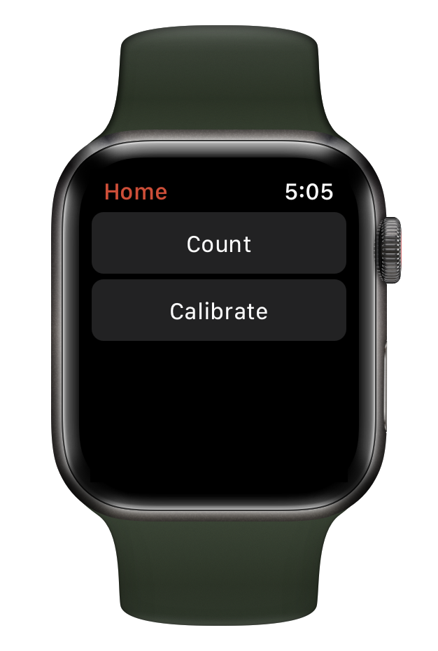
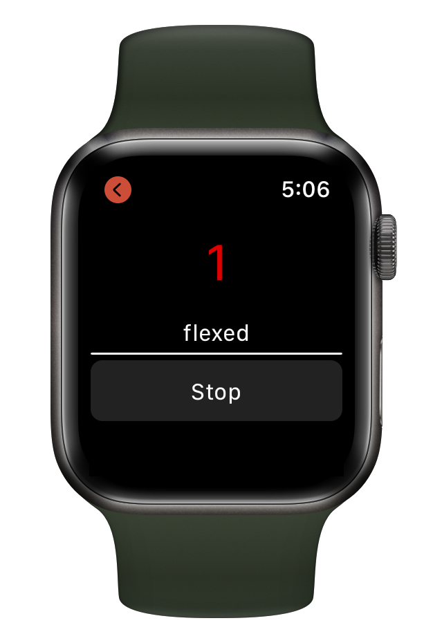
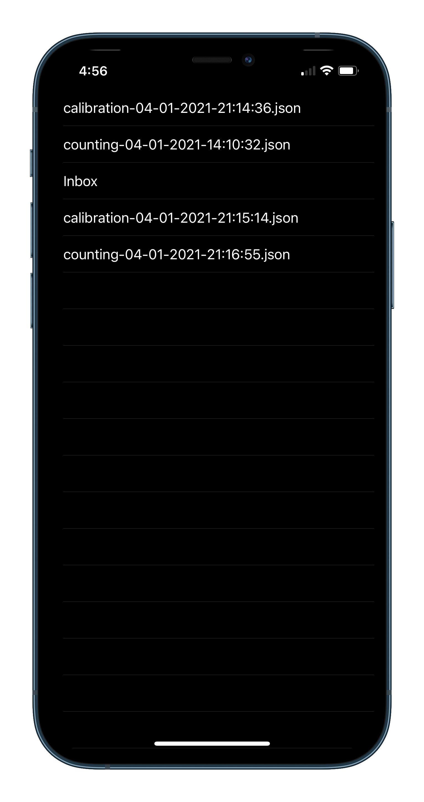

# Workout Tracker

An Apple Watch application where users can calibrate the app to count repetitions for their choice of exercise.
Supports iOS 13.2 and above, WatchOS 4.0 and above.

Read how it works on [Medium](https://anmolparande.medium.com/real-time-signal-processing-on-the-apple-watch-counting-exercise-repetitions-a224f2b678ca).

## Apple Watch Application

The code for the Watch application can be found in the `Workout Tracker WatchKit Extension` folder.
From the Watch, the user can choose to calibrate or count.
If they choose calibrate, they are taken to a screen.
The watch will guide them through 5 repetitions of the exercise by vibrating every time it is time to change position.
If they choose count, they can start the workout and do repetitions while the watch counts them.

## iPhone Application

The code for the iPhone application can be found in the `Workout Tracker` folder.
The iPhone application is used to get a JSON array of the sensor data. It is useful for debugging and analyzing the sensor data.
The Apple Watch uploads the sensor data of every workout session (both Calibration or Counting).
